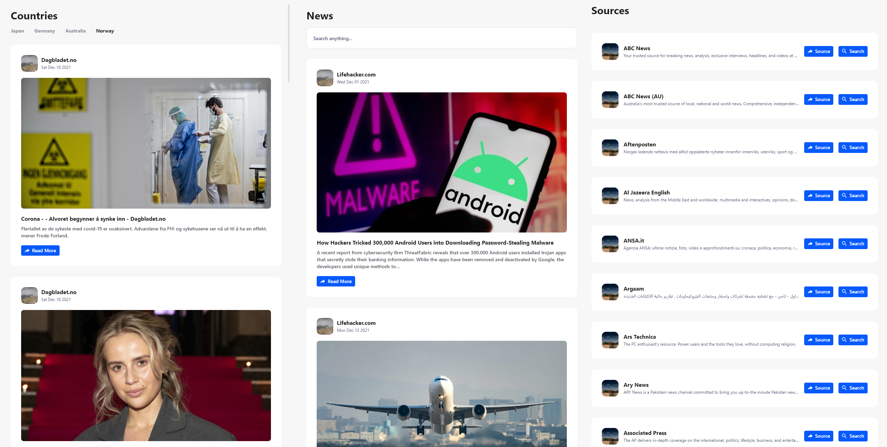
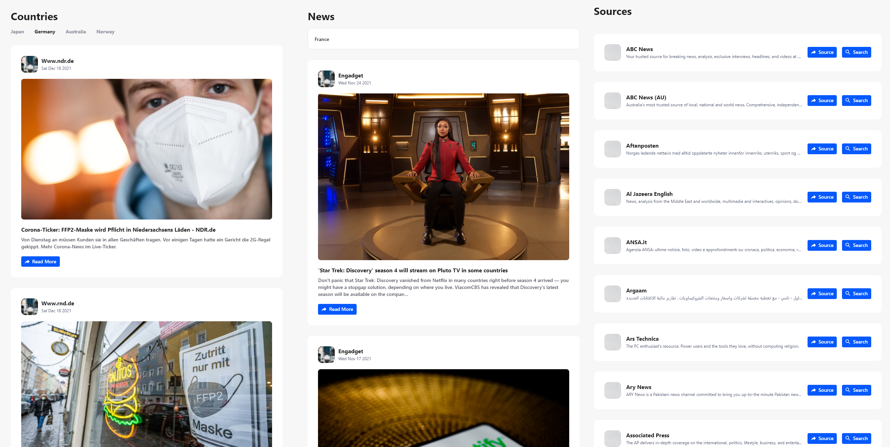
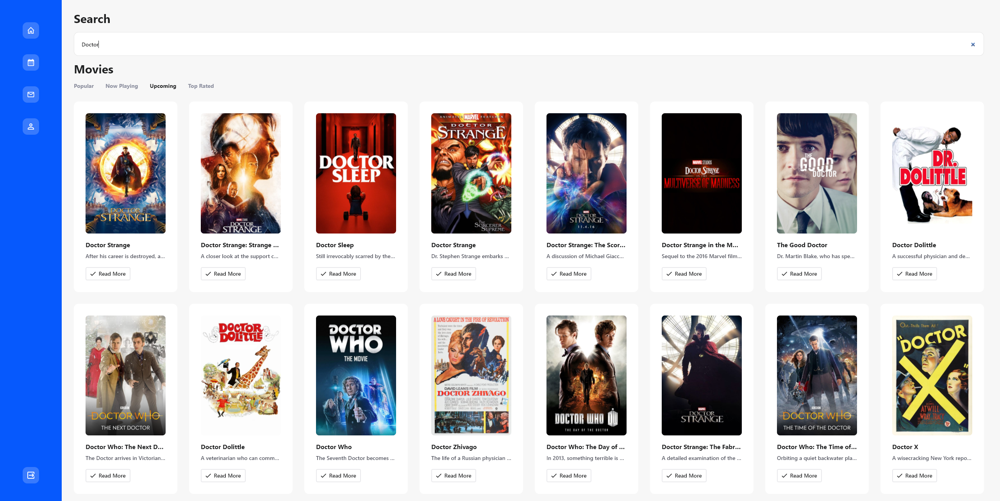
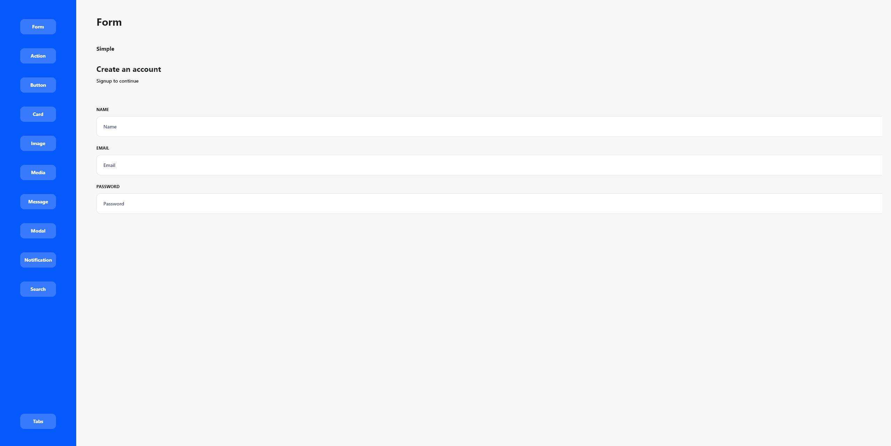
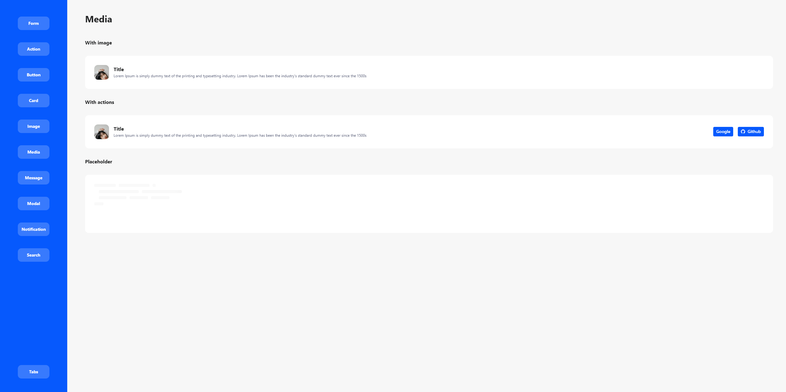

# Typhon UI Svelte

_User interfaces examples via code 🎨 for **Typhon UI**_

_**All components are built using [svelte](https://svelte.dev/) !**_

### 🧱 Installation

Install the dependencies...

```bash
cd typhon-ui-svelte
yarn
```

...then start [Rollup](https://rollupjs.org):

```bash
yarn dev
```

Navigate to [localhost:5000](http://localhost:5000). You should see your app running. Edit a component file in `src`, save it, and reload the page to see your changes.

By default, the server will only respond to requests from localhost. To allow connections from other computers, edit the `sirv` commands in package.json to include the option `--host 0.0.0.0`.

---

### 🔍️ Usage Example

**Available App examples, switch in src/main.ts** ⚗️

- **MovieDB** (Needs API Key) - _AppMovieDB.svelte_
- **NewsAPI** (Needs API Key) - _AppNews.svelte_
- **Typhon UI**'s Components - _AppRenderComponents.svelte_

_This example was handwritten in [svelte](https://svelte.dev/)_

```javascript
import App from './AppNews.svelte'; /** here */

const app = new App({
  target: document.body,
  props: {
    name: 'world',
  },
});

export default app;
```

---

### 📸 Screenshots

**NewsAPI**





**MovieDB**




**Typhon UIs Components**





---

### 📄 Open source license

If you are creating an open source application under a license compatible with the [GNU GPL license v3](https://www.gnu.org/licenses/gpl-3.0.html), you may use `typhon-ui-svelte` under the terms of the GPLv3.

### 👥 Contributing

[Bugs](https://github.com/qtagon/typhon-ui-svelte/issues?q=is%3Aopen+is%3Aissue+label%3Abug), [PR](https://github.com/qtagon/typhon-ui-svelte/pulls) are always appreciated.

**Typhon UI** is an GPLv3-licensed open source project with its ongoing development made possible thanks to the support by the community, **_substantial contributors may get a GPLv3 free license_**.

Flow:

1. Fork it
2. Create your feature branch (`git checkout -b my-new-feature`)
3. Test your changes to the best of your ability.
4. Update the documentation to reflect your changes if they add or changes current functionality.
5. Commit your changes (`git commit -am 'Added some feature'`).
6. Push to the branch (`git push origin my-new-feature`)
7. Create new Pull Request

### 📝 MIT license

If you are looking for a GPLv3 free license, contact [me](https://github.com/dorin-musteata).
